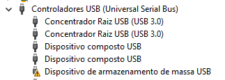
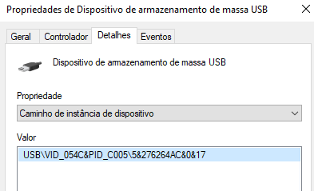
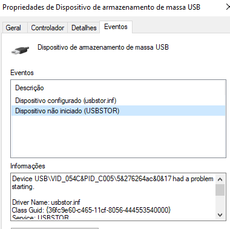
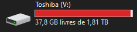

# Restart USB Storage Device Script

This PowerShell script was designed to restart a *Toshiba external Canvio Desk 2TB 3.5''* hard drive device that has a faulty connection to a Windows 10 OS. It can be generalized for any USB device exhibitingconnections problems, however. 
In this particular case, the problem could be either hardware-related (such as faulty or damaged data or power cables) or software-related. Interestingly, the issue does not seem to manifest on Linux OS distros, suggesting it might be software-related.

## Usage

1. Replace the `deviceInstanceId` in the script with the actual Device Instance ID of your device.
2. Run the script.

## How to Find Device Instance ID

There are two methods to find the Device Instance ID:

### Method 1: Using Device Manager

1. Open the Device Manager. You can do this by typing "Device Manager" into the search bar on the taskbar and selecting the application from the list that appears.
2. In the Device Manager, look for the device that is having problems. It might have a yellow, trianglular "Warning ⚠" icon next to it.

   
3. Right-click on the device and select "Properties".
4. In the Properties window, go to the "Details" tab.
5. In the "Properties" dropdown menu, select "Device instance path". The value that appears in the "Value" field is the Device Instance ID.

   

6. (Confirmation) Go to the "Events" tab. The Device Instance ID should also appear here, along with a description of any problems the device is experiencing. Look for events with descriptions such as "Device configured" or "Device not started".

   

### Method 2: Using Command Line

1. Use the `pnputil.exe /enum-devices` command in your terminal to list all devices available on the computer.
2. Copy the output and paste it into a text editor. Look up the name of the drive formatted in the USB storage device (e.g., "Toshiba" or whichever label you gave to it) to find the Device Instance ID.

    

Replace the `deviceInstanceId` in the script with the value you found.

Please refer to the step-by-step screenshots for more detailed instructions.

## What the Script Does

The script uses the `pnputil.exe /restart-device` command to restart the specified device, effectively resetting the connection and potentially resolving any issues.
